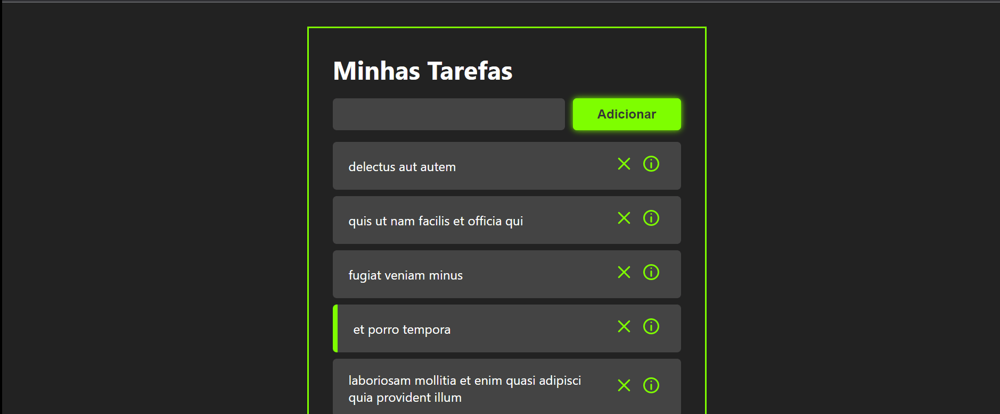

# Lista de tarefas

Este é o projeto de uma To-Do List que foi feito com Reactjs, utilizando o axios para consumo da API responsável por gerar as tasks, uso do toastify para um alerta dinâmico para que quando o usuário clicar no botão de adicionar sem ter digitado nada no input um alerta apareça na tela informando-o que não é possível add tasks vazias, o usuário pode escrever a tarefa que deseja adicionar e  clicar no enter para completar a ação, sem a necessidade de clicar no botão de adicionar se assim preferir. Toda vez que ele clicar numa tarefa para marcá-la como concluída sua borda fica verde, ele pode excluir uma tarefa clicando no "x" ou clicar no ícone de informação para entrar na task e ver os detalhes dela. 

# Aprendizado/melhorias:

⚛️Axios; 

⚛️Toastify; 

⚛️useState; 

⚛️useEffect; 

⚛️react-router-dom; 

⚛️netlify; 

⚛️react icons; 

⚛️inserção de uma nova tarefa digitando seu nome e clicando em enter sem necessidade de clicar no botão; 

## Veja o projeto completo:

https://the-great-keitey-site.netlify.app/

## Feito Com:

### Contato

  
   

Copyright © 2022 Keitey Lopes Barros

